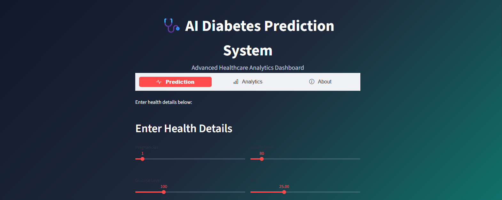

# Diabetes Risk Prediction

This project predicts diabetes risk using Random Forest and SHAP explainability.

## Features
- Random Forest Classifier
- SHAP Explainability
- Streamlit Dashboard
- ROC-AUC Evaluation

## Tech Stack
- Python
- Scikit-learn
- SHAP
- Streamlit

## Author
Your Name

## App Screenshot

